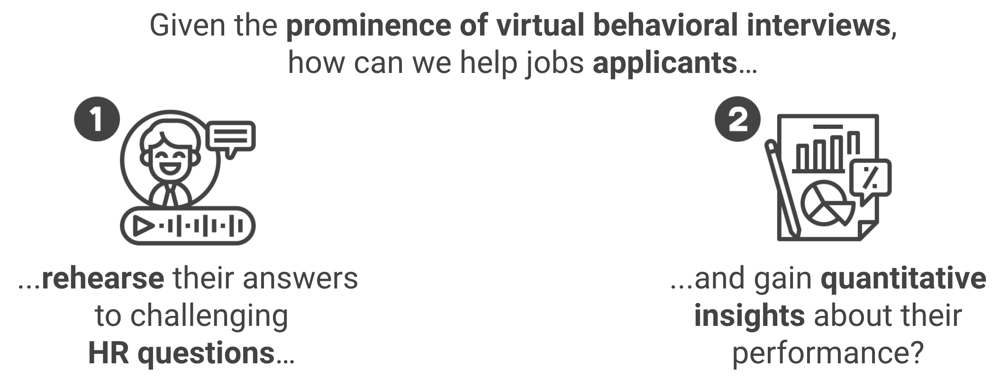

# Preparing behavioral interviews with NLP and audio DSP

## :dart: Description & objective

Video interviews have become the norm over the last few years. However, creating a connection with the interviewer becomes harder with the distance. This puts to the test the communication skills of interviewees, who tend to have a hard time improving these skills on their own. Indeed, being your own judge is never easy, and finding other people to provide precise quantitative feedback is also difficult. To solve these issues, in 2020, three Data Scientist interns and I built an assistant to help applicants analyze their own oral performance in detail.

In a few words:
<p align="center">
  <a href="#"></a>
</p>


## :bulb: Methodology

To solve our problem, we developed a **coaching platform** that leverages audio DSP, speech-to-text models, and NLP models to analyze **prosody, tone, and speech content**. It works in the following way:
1. a **behavioral question** (out of a series of such questions) is prompted on the user's screen *(see video below at 0s)*
2. the **user records an answer to the question**, and stops the recording whenever he/she wants *(see video below from 0s to 1min13s)*
3. the answer is processed in the backend of the web app *(accelerated in the video)*
4. the **results are displayed in a dashboard** in the user interface *(see video below from 1min14s to the end)*. The user can then: 
> - re-watch the recording of the answer
> - read the transcript of the response, analyze the <ins>**emotions**</ins> (among anger, surprise, disgust, enjoyment, fear, and sadness) detected in it (highlighted in different colors), the <ins>**key phrases**</ins> identified in it (emboldened), and the <ins>**words orally accentuated**</ins> in it (underlined)
> - check the evolution of the estimated <ins>**valence and arousal of his/her voice**</ins> throughout the video
> - examine overall <ins>**prosodic metrics**</ins> linked to his/her diction (proportion of time spoken, speech rate, number of silent pauses)
> - and ultimately assess how the speech content correlated with what came out of the tone and prosody analyses
5. if the user is not satisfied with some aspects of his/her delivery, new takes can be subsequently done and compared for the same question *(see video below right at the end)*.
6. the user can move on to the next question.


:fr: **Note:** As the project was scoped to French job applicants, the user interface is in French, and the web app expects recordings in French.

:movie_camera: **Video demo of the platform:**


https://user-images.githubusercontent.com/49266337/154789282-ca251890-0788-4346-98f4-56ffd979489b.mp4


> **Question: “Tell us about a tough experience you endured during your studies or your professional career.”**
> 
> **Answer** (completely made up) & **results dashboard**: 
> 1. <ins>from 0s to 38s</ins>, the response evokes failed nationwide exams despite years of preparation, and is thus dominated by **sadness**
> 2. <ins>from 39s to 1min13s</ins>, the response then describes how another year of preparation helped to grow, and is dominated by **satisfaction** (as opposed to previously)
> 3. <ins>from 1min14s to the end</ins>, the analysis shows a **good correlation between emotions detected in the speech content and voice valence & arousal** throughout the delivery. The **order of the emotions** expressed in the answer seems **appropriate** for such a question about a tough experience ("rebound").


## :file_folder: Repository organization

The web app is organized in the following way:
<p align="center">
  <a href="#"></a>
</p>

which is reflected in the organization of the repo. Indeed:
> - the ```front``` folder contains all the client components that compose the user interface (video player, elements of the results dashboard like graphs,...)
> - the ```back``` folder contains all the server routes/controllers, database schemas, and services used to compute insights sent to the client (speech-to-text conversion, audio DSP code, emotion multilabel classification models trained beforehand, keyphrase extraction algorithms, datasets,...). Following the ```cookie-cutter``` template:
> > - the ```res``` folder contains all the datasets used to train, validate, and test models, as well as checkpoints of trained models
> > - the ```routes``` folder contains all the route and controller functions that directly handle the HTTP requests from the client
> > - the ```src``` folder contains all the source code implementing the services, i.e. datashelves to open and store the data into objects, feature engineering functions to prepare the data, and models to make predictions if needed (and perform re-training/validation).


## :wrench:	Techs used

All the code was written in either ```Python3``` 🐍 (frontend), or ```JavaScript```, ```HTML```, and ```CSS``` :desktop_computer: (backend):
> - the frontend was coded using ```React``` and its Context API, ```Material-UI``` for the visual interface, and ```Axios``` to query the backend via HTTP
> - the backend was coded using ```Flask```:
> > - data wrangling was done using ```Pandas```
> > - speech-to-text conversion was done using Google's Speech API (for lack of a good-enough open-source speech recognition model for French at the time)
> > - keyphrase extraction was done using code from ```topicrankpy``` and ```SpaCy```'s pretrained PoS tagging model
> > - emotion multilabel classification was done using ```torch``` and ```transformers``` (using a fine-tuned CamemBERT model on a particular open-source dataset, which was then tested on collected data)
> > - prosody analysis was done using ```myprosody``` 
> - the database leverages ```MongoDB``` to store JS-like objects (questions, batches of questions, and results computed for each user session).


## :family_man_woman_girl_boy: Credits

Thanks to:
> - Benoît de Kersabiec
> - Clément Bidan
> - Nathan Bruckmann

for your contribution on this project!

## :warning: Disclaimer

For file size considerations and security purposes, trained models, datasets used, other sensible information were removed from the code.
